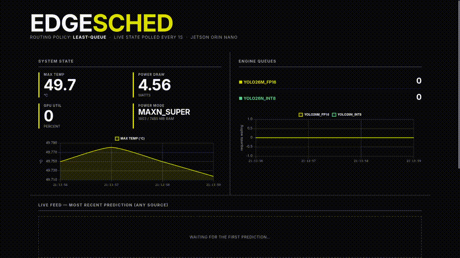
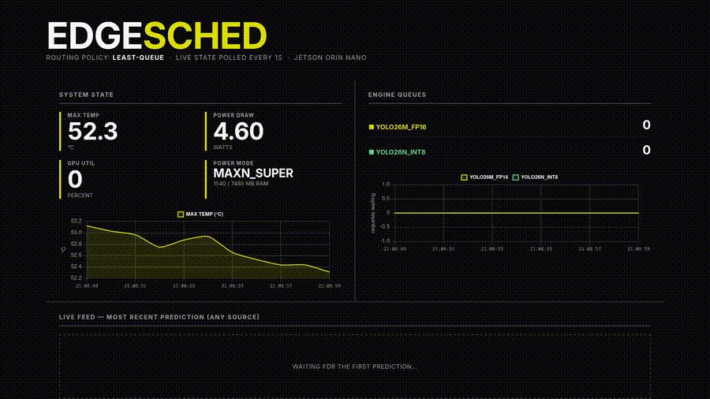
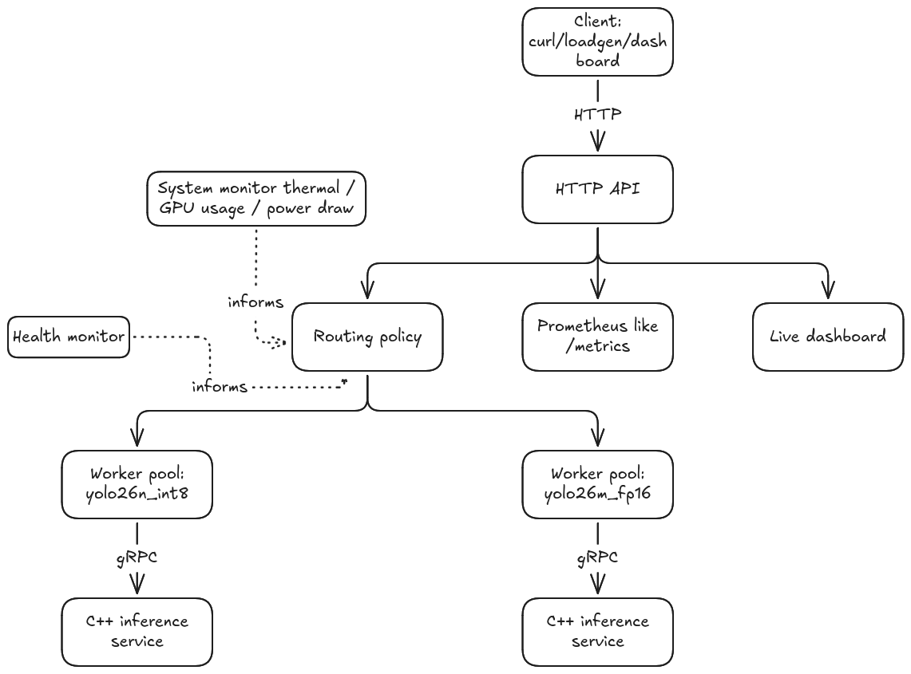
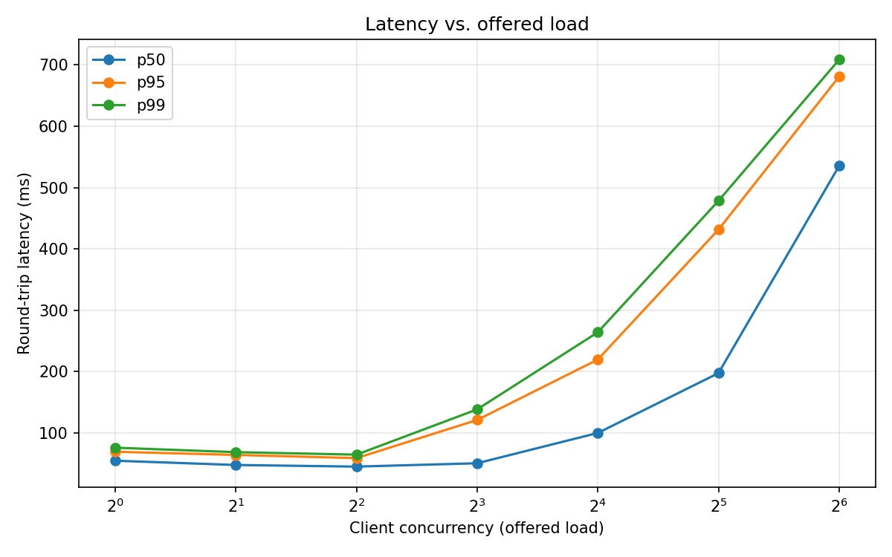
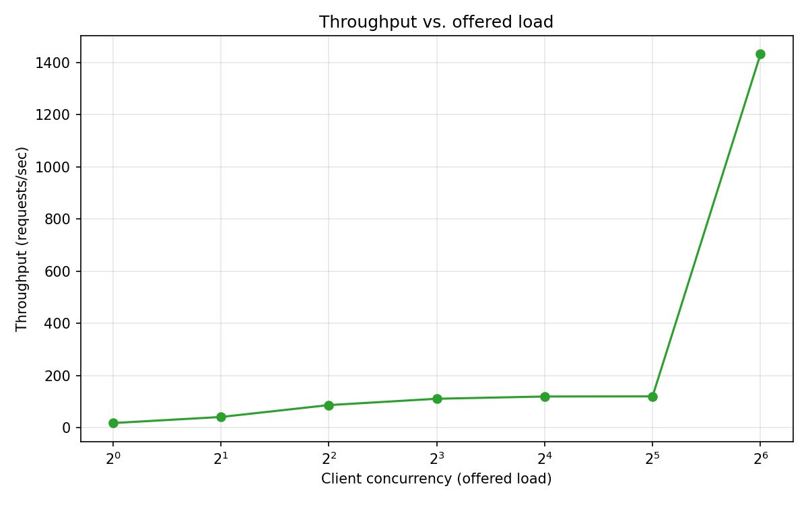
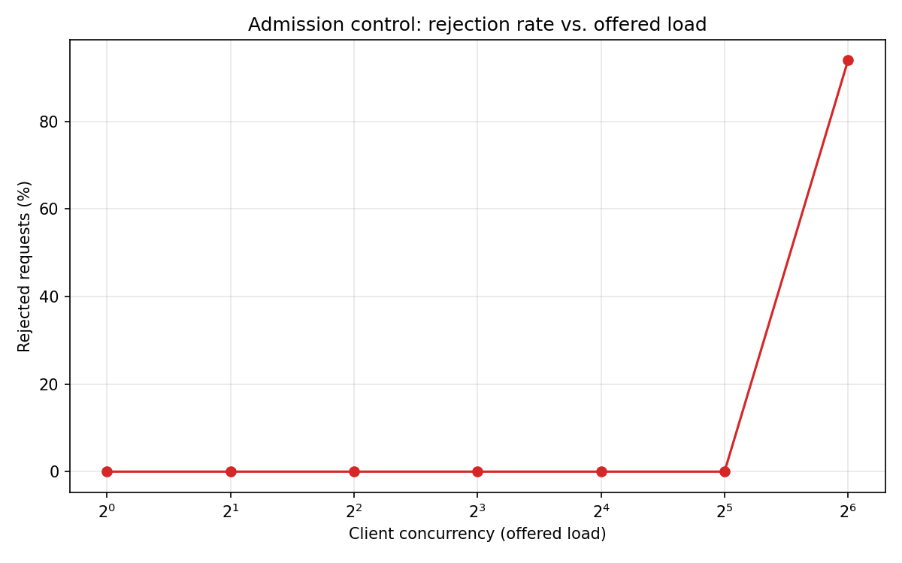
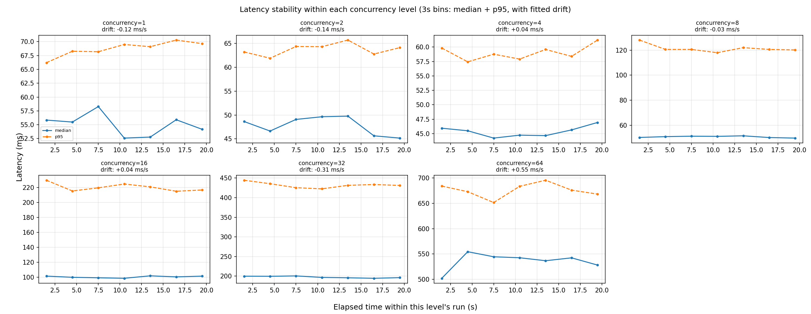
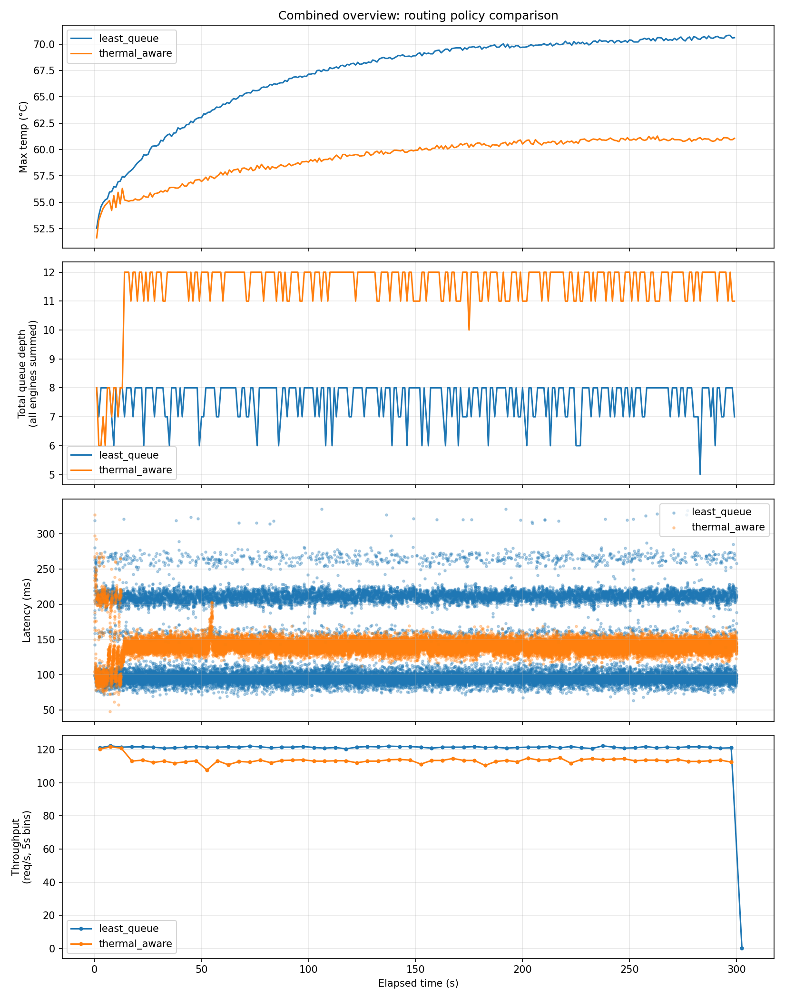

# EdgeSched

A resource aware, multi-model inference serving system for edge hardware (the **Nvidia Jetson Orin Nano**).

Multiple TensorRT engines (different model sizes / quantization tiers) run as
independent C++/gRPC services on a Jetson Orin Nano. A Go control plane routes
requests across them based on **live system state**  thermal headroom, queue
depth, engine health , with a live dashboard,
Prometheus like metrics, and an automated benchmark suite to actually prove it works.

The models are not the important part, the project focuses on  **the scheduling, admission
control, observability, and failure handling around them.**

<p align="center">
  
</p>

<p align="center">
  
</p>

## Architecture



One C++ process per engine tier, independent crash/restart, with a
"microservice per model" shape. The Go side owns everything about *when* and
*where* a request goes; the C++ side owns *how fast inference actually runs* (e.g more optimized than a simpler python runtime).

**Full component-level design docs:**
- [`docs/proto.md`](docs/proto.md): the gRPC/Protobuf contract between Go and C++
- [`docs/engine.md`](docs/engine.md): the C++ inference engine and preprocessing
- [`docs/scheduler.md`](docs/scheduler.md): the Go control plane: routing policy, worker pools, metrics, dashboard, load generation
- [`docs/models.md`](docs/models.md): model selection and export


## Tech stack, and why

| Layer | Choice | Why |
|---|---|---|
| Inference core | C++ / TensorRT | GPU hot path, lowest overhead access to the Jetson |
| Control plane | Go | Goroutines/channels map directly onto worker pools, queuing, and backpressure |
| RPC (Go ↔ C++) | gRPC + Protobuf | Strong typing across languages from one shared contract; a recognizable production pattern in ML infra |
| Metrics | Prometheus like client library | Standard, pull based, no bespoke metrics format |
| Dashboard | Vanilla HTML/JS + Chart.js | Monitoring tool |
| Benchmarking | Go (`loadgen`, `statscraper`) + Python/matplotlib | Load generation stays consistent with the rest of the stack; charting doesn't need to be |


## What's built

- **Bounded worker pools per engine**: fixed concurrency, bounded queue, non blocking admission control (`503` on overload, not indefinite queuing)
- **Two routing policies**: `least-queue` (pure load balancing) and `thermal-aware` (restricts to a cheaper tier once temperature crosses a threshold), both round robin fairly among ties
- **Background health monitoring**: dead engines are detected automatically and excluded from routing
- **Client-specified latency budgets**: an optional per request deadline that propagates through routing and the worker queue
- **Prometheus metrics** (`/metrics`): and structured logging (`log/slog`)
- **A live dashboard**: real time system state, per engine queue depth charts, a form to send a single image, a "Live Feed" panel showing predictions from *any* source (curl, a benchmark run, the form itself), and a browser webcam live inference mode
- **A load generation and benchmarking toolchain** (`cmd/loadgen`, `cmd/statscraper`) with automated plotting


## Results

### Chapter 1–3: latency, throughput, and admission control under load

A concurrency sweep (1 -> 64 concurrent clients), each level run for a fixed,
comparable duration:

<p align="center">
  
  
</p>

Admission control actually engaging once offered load exceeds total server
capacity (at 64 concurrent clients the load becomes too high):

<p align="center">
  
</p>

Whether latency stays flat throughout each level's run or drifts as it goes (the sweet spot seems to be 4 concurrent clients):

<p align="center">
  
</p>

### Does thermal aware routing actually do anything?

The experiment aims to show whether different routing policies have different effects.
A sustained load pattern is used and ran twice once under `least-queue`, once under
`thermal-aware`, with a real thermal cooldown gate enforced between runs so
the comparison starts from a fair baseline.

<p align="center">
  
</p>

Thermal aware shows lower temperature generally speaking (which is good as it means the increase of degrees is slowed) and a higher queue-depth. This can be explained on the preference of the thermal aware routing policy to pick the "cheap" tier over and over not distributing the work on more worker pools.


## API Reference

| Method | Path | Query Parameters | Request Body | Response | Notes |
|---|---|---|---|---|---|
| `POST` | `/predict` | `engine` *(optional)* explicit engine override; omit for automatic routing<br>`latency_budget_ms` *(optional)*  per request deadline, clamped to `-max-latency-budget-ms` | Raw image bytes (JPEG/PNG) | JSON: `engine`, `detections[]`, `preprocess_ms`, `inference_ms`, `postprocess_ms`, `queue_depth_at_submit`, `auto_routed`, `latency_budget_ms` | `503` if the engine's queue is full or every engine is unhealthy; `504` if the latency budget expires; `400` on bad/empty input |
| `GET` | `/health` | `engine` *(required)* | — | JSON: `serving`, `engine_name` | On-demand, direct gRPC passthrough — bypasses the worker pool. Distinct from the background health monitor that actually drives routing decisions. |
| `GET` | `/status` | — | — | JSON: `policy`, `engines[]` (`name`, `queue_depth`, `healthy`), `system` (temp/power/GPU/RAM/power mode), `last_result_at` | Polled by the dashboard every second; also the cheap check used before fetching `/last-result` |
| `GET` | `/last-result` | — | — | JSON: `image_base64`, `engine`, `auto_routed`, timings, `detections[]`, `timestamp_ms` | The most recent **successful** prediction from *any* source (curl, `loadgen`, the dashboard's own form). `404` if nothing has succeeded yet. |
| `GET` | `/metrics` | — | — | Prometheus text exposition format | Counters (`edgesched_requests_total`, `edgesched_routing_decisions_total`, `edgesched_admission_rejections_total`), histograms (`edgesched_request_duration_seconds`), and pull-based gauges (queue depth, temp, power, GPU%, RAM) |
| `GET` | `/` and static paths | — | — | The embedded dashboard (HTML/JS/CSS + vendored Chart.js) | Served via `go:embed`; matches everything not claimed by the routes above |


```bash
# 1. Build everything ( prerequisites: TensorRT, CUDA, OpenCV, protobuf/gRPC, Go 1.22+)
cd inference_engine/build && cmake .. && make
cd ../../scheduler && go build ./...

# 2. Start both engines + the scheduler in one command
cd ..
./run_all.sh

# 3. Open the dashboard
#    http://<jetson-ip>:8080/

# 4. Send an image
curl -X POST --data-binary @bus.jpg http://localhost:8080/predict

# 5. Run the benchmark suite
cd benchmarks
./run_sweep.sh --dir /path/to/some/images
python3 plot_sweep.py results/sweep

./run_session.sh --label least_queue --dir /path/to/some/images --duration 5m
# (restart scheduler with -routing-policy=thermal-aware ...)
./run_session.sh --label thermal_aware --dir /path/to/some/images --duration 5m
python3 plot_policy_comparison.py results/least_queue results/thermal_aware
```

---

## Repository structure

```
EdgeSched/
├── README.md                   (this file)
├── run_all.sh                  starts both engines + scheduler, one command
├── docs/                       component-level design docs
│   ├── proto.md
│   ├── engine.md
│   ├── scheduler.md
│   ├── models.md
│   └── img/
├── proto/                      shared gRPC/Protobuf contract
├── inference_engine/           C++ inference service (TensorRT, gRPC)
├── inference_model/            model export scripts, ONNX/TensorRT artifacts
├── scheduler/                  Go control plane
│   ├── cmd/scheduler/          entrypoint
│   ├── cmd/loadgen/            benchmark load generator
│   ├── cmd/statscraper/        time series system state collector
│   ├── cmd/sysmonitor_debug/   standalone tegrastats parsing validator
│   ├── internal/               routing, worker pools, health checks, metrics, etc.
│   └── web/                    embedded live dashboard
└── benchmarks/                 sweep/session orchestration + plotting scripts
```

---

## Known limitations / future work

- **Concurrency and queue size are global, not per engine**: a reasonable
  refinement, not yet built.
- **No TLS or authentication** on the HTTP API or gRPC connections
  acceptable for an isolated dev link, not for anything beyond that.
- **No real Prometheus/Grafana deployment**: `/metrics` is real and
  scrapeable, but this project uses lightweight custom tooling
  (`statscraper` + matplotlib) rather than standing up the full monitoring
- **The dashboard's browser JavaScript has no automated test coverage**:
  an acknowledged gap; verification has been manual, end to end, in a real
  browser.
- **A third, differently-shaped model** (e.g. a classifier, to exercise
  genuinely heterogeneous workloads rather than two sizes of the same
  detector)
