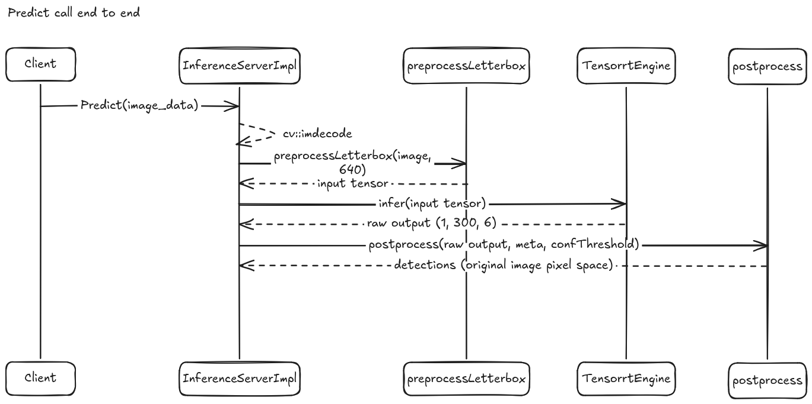
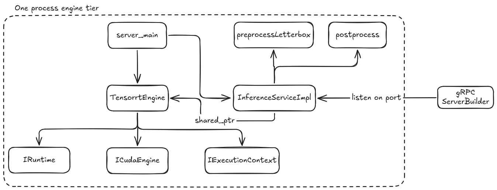

# Inference Engine
Each model runs as its own C++ process, hosting one Tensorrt engine and exposing it over gRPC via the *Inference* service.

Tensorrt and C++ are used as they represent a standard solution to access the GPU on the Nvidia Jetson Orin Nano. Preprocessing and postprocessing
run in the same process as to avoid complicating client programs or expensive copying processes. 

---

## Components

| Component               | Responsibility                                                                                                    |
| ------------------------ | ------------------------------------------------------------------------------------------------------------------ |
| **`TensorRTEngine`**     | Loads a `.engine` file, allocates device buffers for each I/O tensor, runs inference. One instance is one loaded model. |
| **`preprocessLetterbox`**| Resizes and pads an input image to the network's expected size, preserving aspect ratio, and converts it to a normalized CHW float tensor. |
| **`postprocess`**        | Parses raw engine output into detections, filters by confidence, and maps box coordinates back to the original image's pixel space. |
| **`InferenceServiceImpl`**| Implements the generated `Inference::Service` interface (`Predict`, `HealthCheck`), wiring the above three together and handling image decode and timing. |

---

## Threading and concurrency

`TensorrtEngine`'s `IExecutionContext` is not safe to call from multiple threads concurrently. gRPC's default (sync) server dispatches each
incoming RPC on a thread from its own pool, so without protection, two `Predict` calls arriving close together could race on the same execution
context.

`InferenceServiceImpl` guards this with a mutex around the `engine_ -> infer()` call, so concurrent requests to one engine process
queue and wait rather than racing. This is a correctness requirement for this service considered in isolation, real cross engine concurrency (running
the fast and accurate tiers in parallel) is what the Go scheduler job.

---

## Diagrams
### Request sequence diagram
Shows one `Predict` call end to end:

### 2. Component ownership diagram
Shows what owns what. Visualizes the "one process per engine" decision and where the mutex sits relative to the engine.

