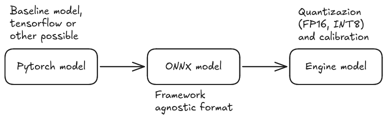

# Models
The scheduler itself does not distinguish between models as it is completely based on performance and resource usage metrics. Given a general will to have an app working in the image classification / object detection field, a few models have been chosen to highlight the difference in throughput and resource usage:
- Yolo26m quantized FP16, as the  "*big*" and power intensive model;
- Yolo26n quantized INT8, as the "*small*" model.
---
The procedure to get a working model to be ran on the jetson orin nano gpu as a tensorrt engine can be found in the ultralytics documentation, but as a general rule the following steps need to be taken:
- obtain the .pt (*pytorch*) model, `inference/download_yolo_models.py`;
- export the .pt model in *ONNX* format, `inference/export_onnx.py`;
- create the *.engine* model (tensorrt format), `inference/export_onnx.py`. Here quantizazion and calibration need to be configured.

