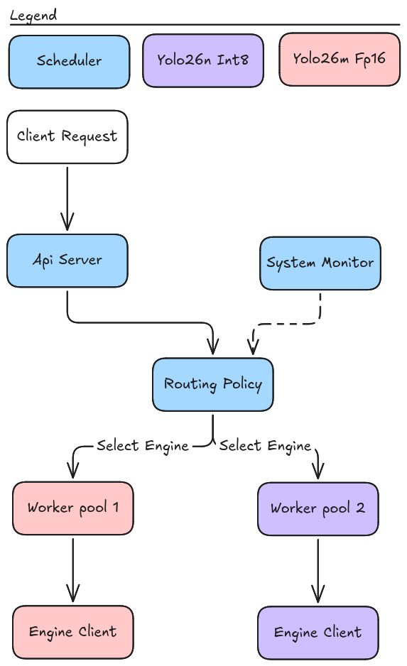

# Scheduler (Go Control Plane)

The Go control plane is the client-facing side of EdgeSched, it connects to one or more C++ inference engines over gRPC (see [proto.md](proto.md) for the wire contract, [engine.md](engine.md) for what's on the other end of that connection) and exposes an HTTP API in front of them.

---

## Why Go here specifically
- Goroutines and channels map directly onto the eventual problem this component exists to solve: bounded per engine worker 
  pools, request queuing, backpressure, timeouts;
- Recognizable pattern in infra/platform engineering generally.

---

## Components

| Component | Responsibility |
|---|---|
| **`cmd/scheduler/main.go`** | Process entrypoint. Parses `-engines` (name=address pairs) and `-listen` flags, constructs one `engineclient.Client` per configured engine, starts the HTTP server. |
| **`internal/engineclient.Client`** | Wraps one gRPC connection to one inference engine process. Exposes `Predict(ctx, imageData)` and `HealthCheck(ctx)`. One instance per engine tier. |
| **`internal/api.Server`** | HTTP handlers (`POST /predict`, `GET /health`), each taking an `engine` query parameter and proxying to the matching `Client`. |
| **`internal/sysmonitor.Monitor`** | Polls `tegrastats`/`nvpmodel` in the background, exposes the latest system state (thermal, power, memory, GPU utilization) via a lock free atomic snapshot. |
| **`cmd/sysmonitor_debug`** | Standalone tool to validate `sysmonitor`'s parsing against real device output before trusting it anywhere else. |
| **`internal/routing.Policy`** | Selects which engine handles a request. `LeastQueuePolicy` (pure load balancing) and `ThermalAwarePolicy` (restricts to a cheap tier once hot) implement it. |
| **`internal/metrics.Registry`** | Prometheus like metrics: imperative counters/histograms for requests and routing, pull based gauges for queue depth and system state. |
| **`web.Handler()`** | Serves the embedded dashboard (system state, live charts, predict form, Live Feed panel showing predictions from any source). |
| **`cmd/loadgen`** | CLI: sends every image in a directory to the scheduler concurrently, reports latency/throughput stats, optional CSV export. |
| **`internal/healthcheck.Monitor`** | Polls each engine's `HealthCheck` RPC in the background; both routing policies exclude unhealthy engines automatically. |

---

## System Monitor
`internal/sysmonitor` polls Jetson system state in the background and exposes the latest reading via a lock free atomic snapshot (`atomic.Pointer[State]`), so routing decisions can read current state without blocking on or triggering fresh I/O.

### Design

- **`tegrastats`** is run as one long lived subprocess (`--interval 1000`) without needing multiple calls;
- **`nvpmodel -q`** is polled separately, on a slower 5 second cadence, since power mode changes rarely and doesn't need per
  second freshness;

---

## Dashboard and Load Generation 

### Dashboard (`web/`)

A single static HTML/JS page, embedded directly into the compiled scheduler binary via `go:embed` (`web/embed.go`), no separate directory needs to be deployed alongside the binary, and the dashboard can never drift out of sync with the server it ships inside.

**Two purposes**:
- **Passive monitoring**: live system state (temp, power, GPU%, RAM, power mode) and per engine queue depth, each on a real 
  line chart , polling `GET /status` every second.
- **Interactive**: a form to send an image directly (with an optional
  engine override or latency budget), rendering the routed result with
  bounding boxes drawn client side on canvas.

NB (for live camera feed):
- **Secure-context requirement**: browsers restrict `getUserMedia` to
  HTTPS or `localhost`/`127.0.0.1` origins. Accessing the dashboard as
  `http://<jetson-ip>:8080` from another machine may be blocked outright
  depending on browser policy. Workaround used during testing: SSH
  port-forwarding (`ssh -L 8080:localhost:8080 orin@<jetson-ip>`) so the
  browser sees `localhost`.

### Load generation (`cmd/loadgen`)

A CLI tool that sends every image in a directory to the scheduler's `/predict` endpoint with configurable client side concurrency, and reports aggregate latency/throughput/success statistics, with optional per request CSV export.

Talks to the **scheduler's HTTP API**, not the C++ gRPC service directly

## Health Monitoring and Failure Recovery

Part of the scheduler that healthchecks and restores state if anything goes wrong.

### Design

`internal/healthcheck.Monitor` polls every engine's `HealthCheck` RPC
independently, on its own goroutine, at a configurable interval (`-health-check-interval`, default 3s) with a configurable per-check timeout (`-health-check-timeout`, default 2s). Tracks per-engine `healthy` state behind a `sync.RWMutex`.
- **Assumed healthy at startup**, avoids a window where nothing is routable before the first poll completes. Each engine's 
  first check happens immediately when `Run` starts, not after waiting a full interval, keeping that theoretical window small 
  regardless.
- **`serving=false` (no error) is treated identically to a transport
  error**
