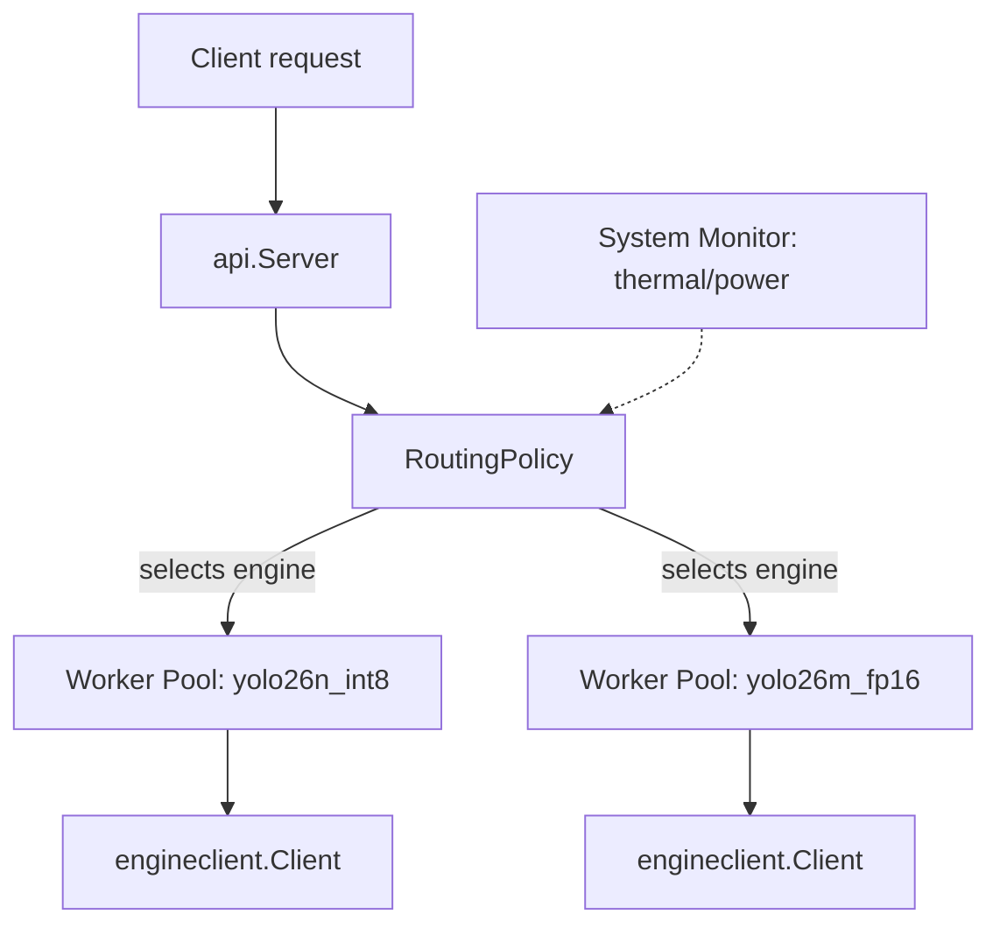

# Scheduler (Go Control Plane)

The Go control plane is the client-facing side of EdgeSched, it connects to one or more C++ inference engines over gRPC (see `proto.md` for the wire contract, `engine.md` for what's on the other end of that connection) and exposes an HTTP API in front of them.

---

## Why Go here specifically
- Goroutines and channels map directly onto the eventual problem this component exists to solve: bounded per engine worker 
  pools, request queuing, backpressure, timeouts;
- Recognizable pattern in infra/platform engineering generally.

---

## Components

| Component | Responsibility |
|---|---|
| **`cmd/scheduler/main.go`** | Process entrypoint. Parses `-engines` (name=address pairs) and `-listen` flags, constructs one `engineclient.Client` per configured engine, starts the HTTP server. |
| **`internal/engineclient.Client`** | Wraps one gRPC connection to one inference engine process. Exposes `Predict(ctx, imageData)` and `HealthCheck(ctx)`. One instance per engine tier. |
| **`internal/api.Server`** | HTTP handlers (`POST /predict`, `GET /health`), each taking an `engine` query parameter and proxying to the matching `Client`. |
| **`internal/sysmonitor.Monitor`** | Polls `tegrastats`/`nvpmodel` in the background, exposes the latest system state (thermal, power, memory, GPU utilization) via a lock free atomic snapshot. |
| **`cmd/sysmonitor_debug`** | Standalone tool to validate `sysmonitor`'s parsing against real device output before trusting it anywhere else. |

---

## Diagrams
Eventually a scheduler will be implemented and this is generally how it will work:

## System Monitor
`internal/sysmonitor` polls Jetson system state in the background and exposes the latest reading via a lock free atomic snapshot (`atomic.Pointer[State]`), so routing decisions can read current state without blocking on or triggering fresh I/O.

### Design

- **`tegrastats`** is run as one long lived subprocess (`--interval 1000`) without needing multiple calls;
- **`nvpmodel -q`** is polled separately, on a slower 5-second cadence, since power mode changes rarely and doesn't need per
  second freshness;
